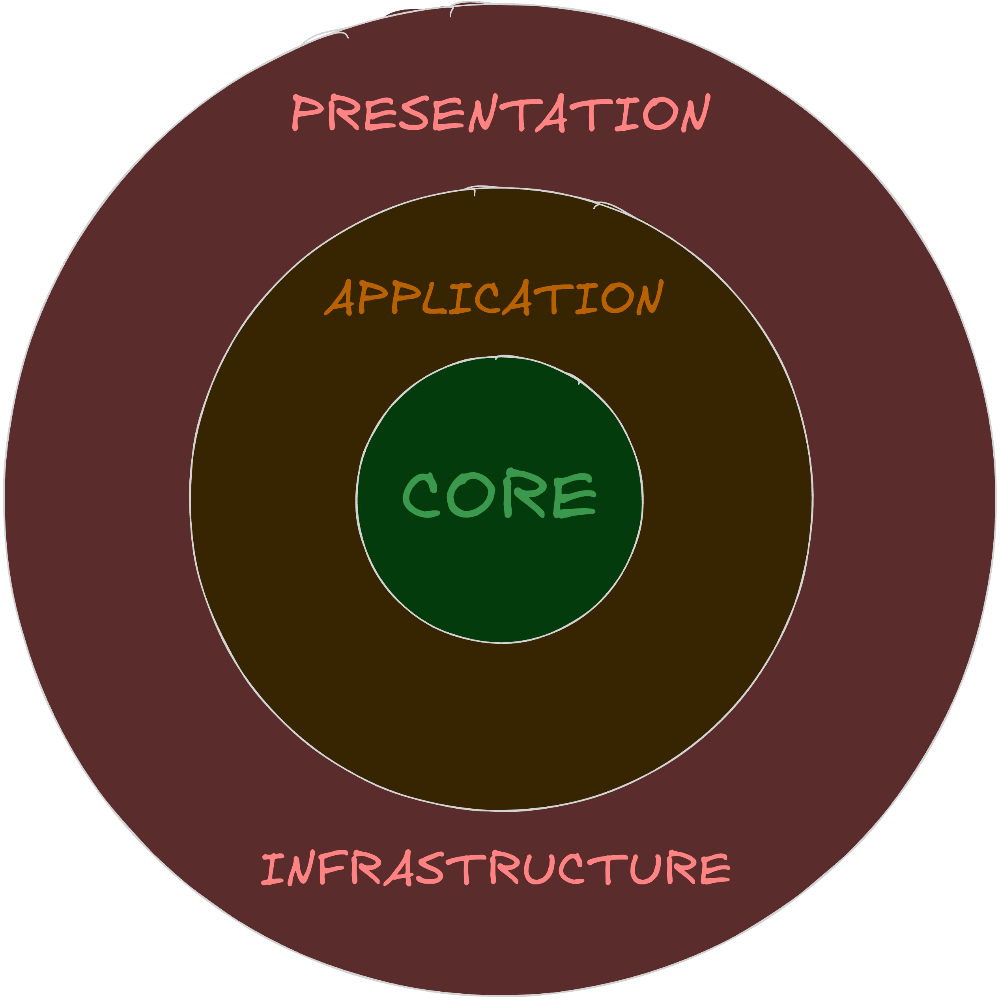

# Documentación de cambios realizados para completar el desafío de Urbano

- Este documento se escribe en español teniendo en cuenta que el desafío se realizó en un entorno hispanohablante.
- Toda la documentacion se va a encontrar en este archivo, incluyendo los pasos realizados, las decisiones tomadas y cualquier otro detalle relevante. La razon principal es que sea sencillo de seguir y entender el proceso completo de desarrollo del desafío (que seria mas complicado si se dividiera en varios archivos).

## Primeros pasos

En un principio fue necesaria una revisión del código existente para entender la estructura y el propósito de cada componente. Como asi tambien entender cuales son los dominios y subdominios que se manejan en el proyecto, ya que esto es clave para poder realizar las modificaciones necesarias.

### Plan a accion

Considero que lo mas importante y urgente es que el proyecto funcione correctamente (lo mejor es tener lo antes posible un proyecto que pueda desplegarse en produccion por mas que tenga deuda tecnica, la cual se ataca mas adelante), sin tener en cuenta por un lado las malas practicas y por otro lado las pruebas automaticas debido a que luego se haran cambios en la estructura de carpetas y archivos que haran que las pruebas automaticas fallen. Por lo tanto, el plan de accion es el siguiente:

1. **Revisar los endpoints de backend y frontend**: Esto es principalmente para saber si para el correcto funcionamiento es necesario desarrollar algun endpoint nuevo o si alguno esta de mas, principalmente para no hacer sobretrabajo y perder tiempo arreglando codigo que no es necesario.

2. **Arreglar aplicacion de nestjs**: La idea es que quede funcional primero en el entorno local, y luego en el entorno de produccion. Es decir, primero arreglar codigo y luego arreglar Dockerfile y docker-compose (solo la parte del backend y base de datos).

3. **Arreglar aplicacion de react**: Al igual que con el backend, primero arreglar codigo y luego arreglar Dockerfile y docker-compose (solo la parte del frontend).

4. **Planteo de refactorizacion**: Una vez que las aplicaciones esten funcionando correctamente y esten listas para desplegar a produccion, se puede plantear una refactorizacion para mejorar la estructura del codigo, eliminar duplicaciones y aplicar mejores practicas. Esto incluye la implementacion de pruebas automaticas para asegurar que los cambios no rompan la funcionalidad existente.

## Cambios para funcionamiento correcto del proyecto

### Backend

- Se creo un archivo `.env.local` y otro `.env.template` (Esto no se agrega al `.gitignore` ya que es para tener de ejemplo con datos dummy) en la raiz del proyecto para tener todas las variables de entorno en un mismo lugar, y sirve para facilitar la configuracion y el despliegue en diferentes entornos.
- Se agrego un volumen para la base de datos en el archivo `docker-compose.yml` para persistir los datos en el entorno local, y tambien se cambiaron algunos datos hardcodeados por variables de entorno.
- Elimine el archivo de config del ORM y lo configure como esta definido en la documentacion para el correcto funcionamiento de las entidades y de la base de datos.
- Hice cambios en la coleccion de Postman, en ese caso agrupe los endpoint en carpetas de acuerdo a los modulos que tiene la aplicacion. Esto fue principalmente para que quede mas legible y organizado. Por otro lado eso rompe con los tests e2e ya que movi los endpoints de lugar, aun que esto no me preocupa tanto ya que es bastante fragil ejecutar los tests de esta manera, ya que solo estamos testeando un happy path. Seria mejor hacer test e2e con supertest o alguna libreria similar que permita hacer pruebas mas robustas.
- Agregue variables de entorno en el `docker-compose.yml` (en el servicio de backend), para que los valores se agreguen de manera dinamica y no queden expuestos los valores en el repositorio.
- Hice un upgrade de la version de bcrypt a la version `6.0.0` que no tiene problemas con versiones mas nuevas de node ni tampoco con la imagen de node:alpine. Otras alternativas eran cambiar a bcryptjs o hacer cambios en la construccion de la imagen de backend ya cambiando la imagen de base de node e instalando las herramientas necesarias para el funcionamiento correcto de los binarios que usa bcrypt.
- Reconstruí el Dockerfile de backend para que la imagen se construya por capas, optimizando así el proceso de construcción y reduciendo el tamaño de la imagen final. Con el Dockerfile previo le imagen de backend tenia un size de `603MB` y ahora tiene un size `233MB`. Aparte quedo definita una version especifica de node y de alpine para asegurar la compatibilidad y estabilidad en el entorno de producción.

### Frontend

- Hice un cambio en las versiones de las librerias que se estaban usando en el `package.json` y reconstrui el `yarn.lock` para hacer limpieza.
- Agregue un script de arranque para que se tomen las variables de entorno desde la raiz del proyecto y porque era necesario sobreescribir una variable para cambiar el puerto que usaba la app en desarrollo.
- Hice un refactor del routing de la aplicacion ya que subi algunas versiones las librerias y esto rompia con el routing anterior.
- Hice un cambio en el `nginx.conf` apuntando a otro puerto para la api y tambien cambie la url base.
- Cambie como se estaba construyendo la imagen de frontend, si bien no hay una mejora en el size, si hay una mejora en la legilibilidad y el orden.

## Refactor y mejoras

### Backend

- Movi algunos archivos que tenian que ver con los roles al modulo de usuario para no tener elementos sueltos en el proyecto, en todo caso si no corresponde a un modulo tendria que ir en alguna carpeta `shared` o `common`.
- Separe cada modulo del proyecto en 3 capas:
  
  - La capa central que es la mas importante (Core) todo lo relacionado al dominio de negocio y dominio tecnico (un logger seria dominio tecnico):
    - entidades
    - enums
    - value objects
    - abstracciones de (repositorios, servicios, etc)
    - dtos de dominio
  - La capa que sigue es la capa de aplicacion, que contiene todas las formas de interactuar con nuestro dominio, si es que no tenemos que usar algo del dominio directamente:
    - casos de uso
    - comandos
    - servicios (con logica de negocio unicamente)
    - dtos de aplicacion
  - La capa mas superficial es la de infrastructura y presentacion (se podrian trabajar como capas separadas pero estan al mismo nivel de abstraccion):
    - controladores
    - rutas
    - middlewares
    - dtos de infraestructura
    - implementaciones (repositorios, servicios, etc)
    - configuraciones
    - modelos de datos
  - Ahora mismo es necesario desacoplar algunas cosas, por lo que en casi todos los modulos tenemos casi todo en la capa mas superficial. La idea tampoco es ser purista e intentar tener el 100% abstraido, ya que nos perderiamos muchas soluciones que nos ofrece el framework y algunas librerias si vamos a ese extremo.
- Implemente repository pattern en el modulo de user para abstraer la logica de acceso a datos. Tambien cree mappers que se encarguen de la comunicacion entre las capas.
- Cree una abstraccion para bcrypt para no exponer la libreria por toda la aplicacion, y ahora se puede utilizar lo que es el encryption service.
- Cree la capa de aplicacion en el modulo de usuario con todos los casos de uso, dtos y mappers necesario.
- Hice una optimizacion en el servicio de stats para hacer las 3 llamadas a la base de datos en simultaneo ya que no tienen dependencias entre si.
- Creer las pruebas automatizadas para la capa de aplicacion, al menos para los casos de uso, arregle algunos tests que se rompieron con el refactor y agregue la ejecucion de `yarn test` en el Dockerfile, para que la imagen no pueda construirse a menos que pase las pruebas, esto mejoraria la estabilidad de la aplicacion en entornos de CD.
- Cree de nuevo el ormconfig.js para que el cli de typeorm funcione correctamente.
- Hice unas modificaciones en el Dockerfile para que cuando se construya la imagen para levantarla de manera local se ejecuten las migraciones.
- Agregue un healthcheck en el servicio de base de datos porque los primeros intentos para que nest se conecte daban errores hasta que postgres estaba disponible.
- Cree un modulo de Seed para llevarme la logica de creacion del admin fuera del main.ts para que quede mas limpio el codigo, asi tambien es mas facil agregar flujos mas complejos para crear datos en la base de datos.
- Cree un `docker-compose.prod.yml` para hacer el build de las imagenes y poder pushearlas a un repositorio. Esto podria ser o no necesario de acuerdo a la estrategia que se use para desplegar. Lo importante son los archivos Dockerfile que contienen la construccion de las aplicaciones.
- Agregue los comandos para levantar las apps en local y para crear las imagenes listas para produccion.

### Frontend

- Elimine los intervals en los que se hacian requests para obtener la lista de cursos, contenidos y usuarios, ya que se hacia un request por segundo de manera innecesaria. Ahora cuando se hace una modificacion, ya sea creacion, actualizacion o eliminacion, en ese momento se vuelve a hacer el fetch para obtener el listado completo de elementos. Esto se podria mejorar incluso mas si guardaramos en memoria la lista de elementos, y cuando se hace un cambio en algun elemento actualizamos la lista en memoria sin necesidad de hacer un GET de mas para obtener la lista nueva.
- Cambie los export default por export const, para tener una mejor consistencia en la forma en que se exportan los componentes y facilitar su importacion en otros archivos. Esto hace mas facil usar barrel files. Solo no cambie los exports de las pages, teniendo en cuenta que si queremos usar lazy loading es necesario usar el export default.
- Agregue los styles de Urbano al frontend basandomen en el documento compartido para realizar el challenge.
- Arregle el sidebar para que muestre cual es la ruta activa. Y tambien agregue el layout al routing de la aplicacion, es decir, todas las rutas que se coloquen por dentro de `<Route element={<Layout />}>...</Route>` van a estar envueltas en el mismo por defecto.
- Tambien cree un componente `Container` para envolver el contenido principal de la aplicacion y aplicar margenes, paddings y los styles del titulo para no tener que repetir codigo.
- Agrege un hook de `useDebounce` para manejar los cambios en los inputs de busqueda de manera mas eficiente.
- Agregue un hook de `useDebounceState` para manejar el estado de los inputs de busqueda de manera mas limpia.
- Separe el proyecto en modulos, donde cada uno por dentro tiene una separacion de responsabilidades y una estructura de carpetas bien definida. De esta manera se vuelve mas sencillo encontrar el codigo relacionado y mantenerlo organizado, lo que tambien hace mas facil de escalar en caso de ser necesario agregar mas features, lo mismo para el caso de querer separar el proyecto en librerias.
- Cambie los nombres de los archivos para que el naming sea consistente y al final agregue sufijo que indica que hay dentro del archivo.
- Cree archivos barril para que las importaciones queden mas limpias y tambien sirve para poder reorganizar carpetas dentro de cada modulo sin romper los clientes externos al modulo, es decir, quienes importan el codigo ya que no tienen por que saber especificamente en que carpeta se encuentran.
